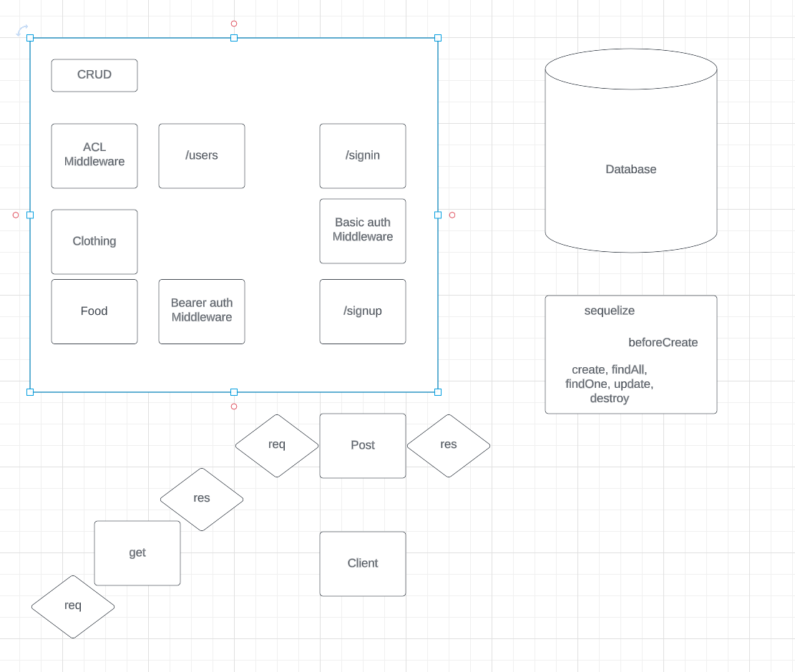

# auth-api

## Approach

- create repo
- add starter code
- add all of the configs
- extract all files from the api server and bring them to the route of auth-api
- npm i
- npm run init:config
- npm run db:create (once you have the names set up in config and env file)
- insert Auth folder into the other repos src folder
- get all routes working so that we only have one root level index and one server file

## UML

## Tests

## Collabs

- Reece Renninger helped me out
- did README as a follow along in code review because my documentation is rough right now
